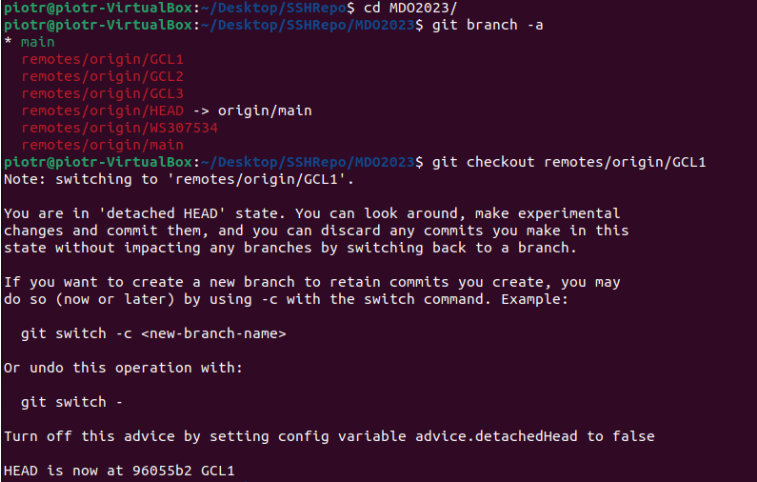

### WERYFIKACJA DZIAŁANIA ŚRODOWISKA LINUXOWEGO
1) 
- Zapewnienie dostępu do maszyny wirtualnej przez SSH

- Polaczenie z maszyna wirtualna przez SFTP

- Sprawdzenie mozliwosci przesylania plikow do maszyny wirtualnej

- Sprawdzenie mozliwosci odbierania plikow z maszyny wirtualnej

2) Instalacja klienta Git w środowisku linuxowym

3) Klonowanie repozytorium za pomocą HTTPS

4)
- Utworzenie dwóch kluczy SSH - ed25519:
Bez hasła

- Oraz z hasłem

- Konfiguracja klucza SSH, jako metody dostępu
Włączenie agenta SSH

- Dodanie klucza do agenta SSH

- Przeczytanie klucza, który został dodany do githuba

- Klonowanie repozytorium za pomocą protokołu SSH

5) Przełączenie się na gałąź swojej grupy (GCL1)

6) Utworzenie gałęzi o nazwie inicjałów i numeru indeksu

7)
- Utworzenie katalogu składającego się z inicjałów i numeru albumu

 
 - Wysłanie zmian do zdalnego źródła

- - Zrobienie pierwszego commita

-  - Oraz wrzucenie go na githuba na swojego brancha

- Wciagniecie swojej galezi do galezi grupowej

